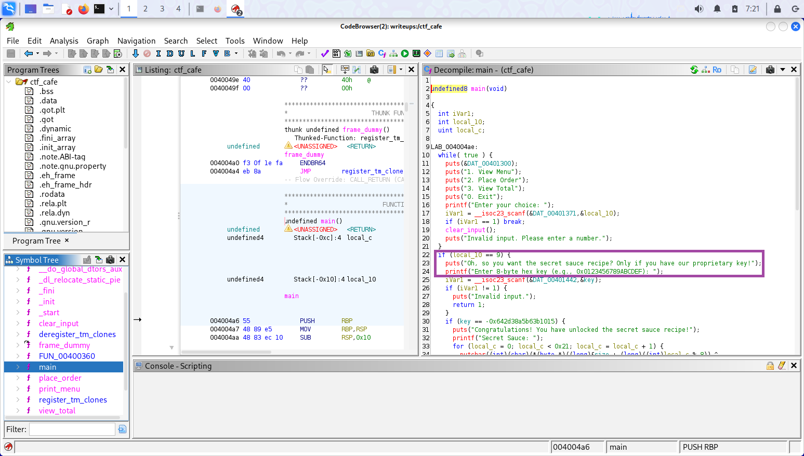

### Find the secret sauce

1. Using Ghidra to reverse engineer ctf_cafe, find the proprietary key in the main function:

-0x642d38a5b63b1015



2. Run the program and choose 9, then enter the secret sauce code:

```
===== 🍔 Welcome to the CTF Cafe! =====
1. View Menu
2. Place Order
3. View Total
0. Exit
Enter your choice: 9
Oh, so you want the secret sauce recipe? Only if you have our proprietary key!
Enter 8-byte hex key (e.g., 0x0123456789ABCDEF): -0x642d38a5b63b1015
Congratulations! You have unlocked the secret sauce recipe!
Secret Sauce: SVBGR{d3c0mp1l3rs_m4k3_l1f3_34sy}
```
